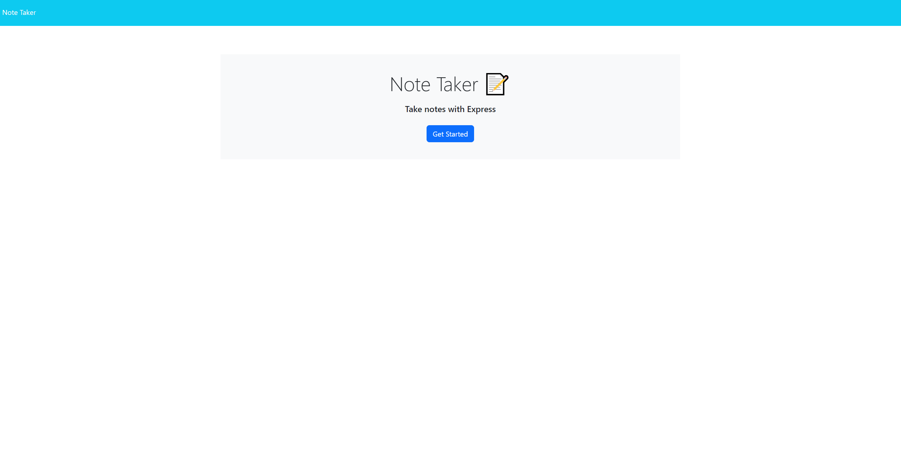

# Note-Taking

## Description
Note Taking is a repository designed to apply server based coding to pre-existing html's and javascript to allow the user to create a Note by giving it a Title and Description and saving it for future visits back to the site. The user can then delete the notes at any point they want.

